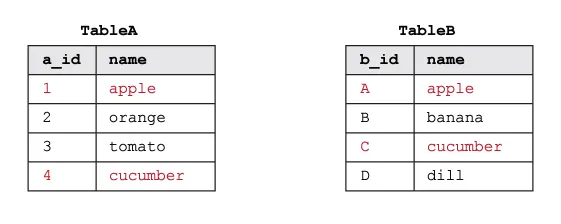
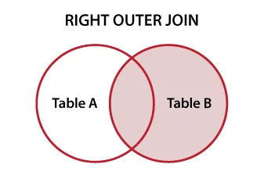

# Jointure_SQL : Explication des types de jointures SQL 

### *Quelle est la différence entre INNER JOIN, LEFT JOIN, RIGHT JOIN et FULL JOIN en SQL ? Quand devez-vous utiliser chacune d'entre elles ? Nous avons vos réponses ici.*

___
___


Une jointure SQL est une **méthode permettant d'extraire des données de deux ou plusieurs tables de base de données**. Cet article présente un aperçu de base de ce à quoi ressembleront les données issues d'une jointure SQL particulière. Une façon populaire de comprendre les jointures SQL est de les visualiser à l'aide de **diagrammes de Venn**. Ainsi, chaque exemple comporte le diagramme de Venn correspondant, l'instruction `SELECT` appropriée et la table de résultat.

Il existe quelques grands types de jointures SQL :

- **INNER JOIN**
- **JOINTURE EXTERNE** [GAUCHE | DROITE | COMPLÈTE]
- **NATURAL JOIN**
- **JOINT CROISÉ**


Nous distinguons l'implémentation de ces jointures en fonction des **opérateurs de jointure** :

- **equi**
- **thêta**


Pour les besoins de cet article, discutons des jointures à l'aide d'un exemple simple. Supposons que nous ayons deux tables de base, TableA et TableB, qui contiennent des données d'exemple. Comme nous allons joindre les tables sur la colonne `name`, nous distinguons les lignes de même nom en les mettant en surbrillance en rouge.





Dans les sections suivantes, nous allons voir ce qu'il advient de ces données lorsque différents types de jointures sont mis en œuvre.

___

# CROSS JOIN

Une **CROSS JOIN est un produit cartésien de TableA et TableB**. Chaque ligne de la TableA est mise en correspondance avec chaque ligne de la TableB ; c'est pourquoi une CROSS JOIN n'a pas de sens dans la plupart des situations.


```
SELECT *
FROM tableA
CROSS JOIN tableB;
```


La TableA et la TableB contiennent 4 lignes. La table résultante aura 4 * 4 = 16 lignes et se présentera comme suit :


___

# INNER JOIN

Un INNER JOIN fusionne UNIQUEMENT les lignes correspondantes dans les DEUX tableaux. Un JOIN sans aucun autre mot-clé de JOIN (comme INNER, OUTER, LEFT, etc.) est un INNER JOIN. Les résultats sont trouvés dans la zone de chevauchement.


```
SELECT *
FROM tableA
INNER JOIN tableB
  ON tableA.name = tableB.name
```

 

Le tableau résultant sera le suivant :


___
  
# JOINTS EXTERNES

**FULL OUTER JOIN** renvoie les lignes correspondantes et non correspondantes des deux tables (c'est une union des deux). S'il n'y a pas de correspondance, le côté manquant contiendra null.


```
SELECT *
FROM TableA
FULL OUTER JOIN TableB
  ON TableA.name = TableB.name;
```


La table résultante sera la suivante :


Un **LEFT OUTER JOIN** renvoie toutes les lignes de la table de gauche (TableA) avec les lignes correspondantes de la table de droite (TableB) ou null - s'il n'y a pas de correspondance dans la table de droite.

Les résultats se trouvent dans tout le cercle de gauche :


```
SELECT *
FROM TableA
LEFT OUTER JOIN TableB
  ON tableA.name = tableB.name;
```


Le tableau résultant sera le suivant :


Un **RIGHT OUTER JOIN** renvoie toutes les lignes de la table de droite (TableB) avec les lignes correspondantes de la table de gauche (TableA) ou null - s'il n'y a pas de correspondance dans la table de gauche.

Les résultats se trouvent dans tout le cercle de droite :





```
SELECT *
FROM tableA
RIGHT OUTER JOIN tableB
  ON tableA.name = tableB.name
```


Le tableau résultant sera le suivant :


___

# Joints basés sur des opérateurs


### Mise en œuvre de l'équi-joint

Cette jointure est réalisée en utilisant l'opérateur d'égalité (=) pour comparer les valeurs de la clé primaire d'une table et les valeurs de la clé étrangère d'une autre table.

```
SELECT *
FROM TableA
INNER/OUTER JOIN TableB
  ON TableA.PK =TableB.Fk;
```


### Mise en œuvre de la jonction thêta (non équi)

C'est la même chose que le JOIN equi, mais il autorise tous les autres opérateurs comme >, &lt, >=, etc.

```
SELECT *
FROM TableA
INNER/OUTER JOIN TableB
  ON tableA.Pk <= tableB.Fk;
```


### Mise en œuvre de l'auto-jointure

Ce type de JOIN est généralement utilisé dans le cas d'un type de relation unaire, où une table est combinée avec elle-même.


```
SELECT *
FROM TableA A1
JOIN TableA A2
  ON A1.Pk = A2.Fk;
```


___

# JOINT NATUREL

Une jointure NATURELLE est un type de jointure EQUI. Il n'est pas nécessaire d'utiliser une clause ON. Les colonnes portant le même nom dans les tables associées n'apparaissent qu'une seule fois.

```
SELECT *
FROM tableA
NATURAL JOIN tableB
```

*En manipulant des mots-clés, nous pouvons exclure des données spécifiques.*

Une **jointure OUTER EXCLUDING** renvoie tous les enregistrements de la table A et tous les enregistrements de la table B qui ne correspondent pas.


```
SELECT *
FROM tableA
FULL OUTER JOIN tableB
  ON tableA.name = tableB.name
WHERE tableA.name IS NULL
  OR tableB.name IS NULL
```


  
Le tableau résultant sera le suivant :


Un **LEFT EXCLUDING JOIN** renvoie tous les enregistrements de la TableA qui ne correspondent à aucun enregistrement de la TableB.


```
SELECT *
FROM tableA
LEFT JOIN tableB
  ON tableA.name = tableB.name
WHERE tableB.name IS NULL
```


Le tableau résultant sera le suivant :


Un **RIGHT EXCLUDING JOIN** renvoie tous les enregistrements de la TableB qui ne correspondent à aucun enregistrement de la TableA.


```
SELECT *
FROM tableA
RIGHT JOIN tableB
  ON tableA.name = tableB.name
WHERE tableA.name IS NULL
```


Le tableau résultant sera le suivant :


